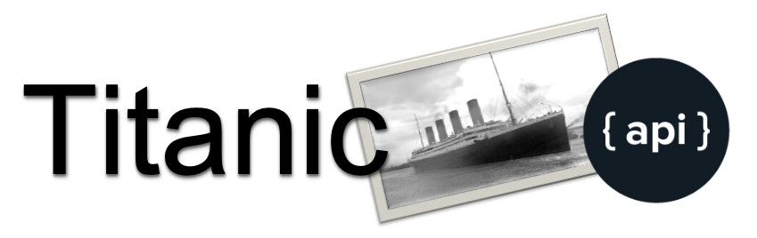
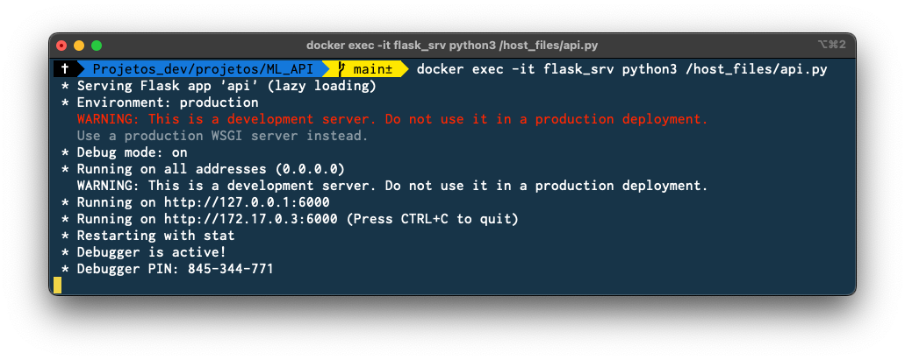
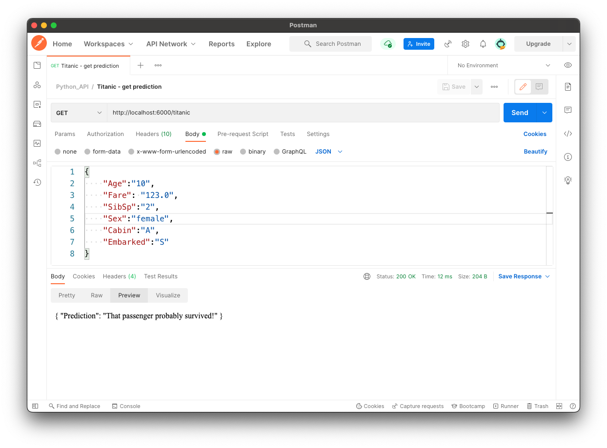
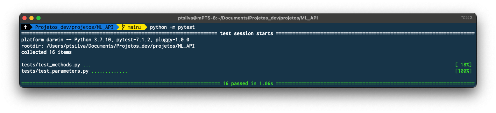

# Machine Learning API



Once you train a Machine Learning model the obvious next step is to embbed it in an application. This can be done by creating an API that returns the model prediction, which the application then can use to use the prediction.

This repository contains an API that predicts using a previously trained ML model (a Decision Tree Classifier).

The API is written in Python and infrastructure as code is provided (in the `dev_env` folder) to host it in a Flask development container (requires Docker esktop).

Training the ML model falls outside of the scope of this exercise, so a previously trained classifier model from my [Titanic GitHub repository](https://github.com/ptavaressilva/titanic) was used.

In order to prepare the data for the model, a previously trained Standard Scaler and One-Hot Encoder are also included.

## Running the API on the local computer (development environment)

**Important**: The following scripts must be run on a terminal, **from the repository root folder**!

1. Run `dev_env/build.sh` to create the Docker image.
2. Run `dev_env/start_linux.sh` to start the container.

The API will be exposed on port 6000 of the localhost and will auto-reload whenever you change (and save) the 'api.py' program.



The API has a single endpoint, called `/titanic`.

You can use it with curl

```shell
curl --location --request GET 'http://localhost:6000/titanic' \
--header 'Content-Type: application/json' \
--data-raw '{
    "Age":"10",
    "Fare": "123.0",
    "SibSp":"2",
    "Sex":"female",
    "Cabin":"A",
    "Embarked":"S"
}'
```

with Postman, or any another similar application of your choosing.



To run tests use `python -m pytest`


