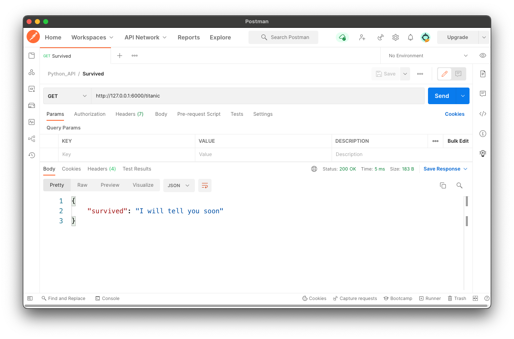

# Machine Learning API

Once you train a Machine Learning model the obvious next step is to embed it in an application. This can be done by creating an API that returns model prediction, which the application can use to incorporate predictions.

This repository contains an example of a Python API that predicts using a previously trained ML model.

The application is written in Python, served with Flask and can the API can be called with Postman. A Docker container is generated to host Flask and the API (requires Docker esktop).

Training the ML model falls outside of the scope of this exercise, so we'll use a previously trained classifier model form my [Titanic GitHub repository](https://github.com/ptavaressilva/titanic).

The API has a single endpoint called `/titanic`.

### Running the API on the local computer

1. In the 'env' directory run './build.sh' to create the Docker image.
2. In the repository root run 'env/start_linux.sh' to start the container.

The API will be exposed on port 6000 of the localhost.

You can use it with Postman (or another application of your choice) with GET on `http://localhost/titanic`

### Current state of the API

In this version (0.1) the API will only return the string `{'survived': 'I will tell you soon'}`

Next version will require passing the values for Age', 'SibSp', 'Fare', 'Sex', 'Cabin' and 'Embarked' and will return the predicted survival of that passenger.
