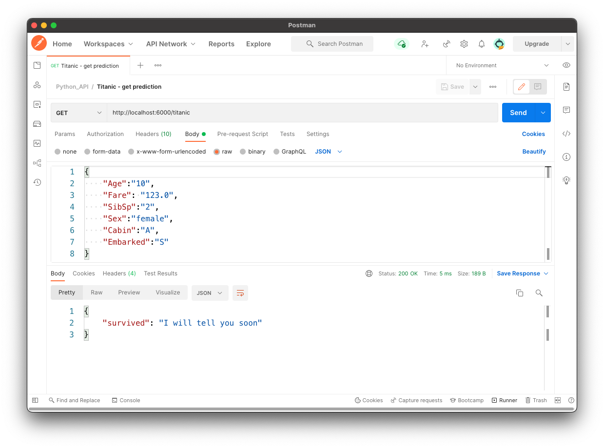

# Machine Learning API


Once you train a Machine Learning model the obvious next step is to embed it in an application. This can be done by creating an API that returns model prediction, which the application can use to incorporate predictions.

This repository contains an example of a Python API that predicts using a previously trained ML model.

The application is written in Python, served with Flask and can the API can be called with Postman. A Docker container is generated to host Flask and the API (requires Docker esktop).

Training the ML model falls outside of the scope of this exercise, so we'll use a previously trained classifier model form my [Titanic GitHub repository](https://github.com/ptavaressilva/titanic).

The API has a single GET endpoint called `/titanic`.

## Running the API on the local computer (development environment)

1. In the 'env' directory run './build.sh' to create the Docker image.
2. In the repository root run 'dev_env/start_linux.sh' to start the container.

The API will be exposed on port 6000 of the localhost and will auto-reload whenever you change (and save) the 'api.py' program.


You can use it with curl:

```shell
curl --location --request GET 'http://localhost:6000/titanic' \
--header 'Content-Type: application/json' \
--data-raw '{
    "Age":"10",
    "Fare": "123.0",
    "SibSp":"2",
    "Sex":"female",
    "Cabin":"A",
    "Embarked":"S"
}'
```
You can also use Postman, or another application of your choice.



## Current state of the API

As of this version (0.2) the API accepts the values required for the prediction of the survival of the passenger, and it validates that those values are valid. It does not however return a prediction of the survival of the (real or imaginary) Titanic passenger. It will only return the string `{'survived': 'I will tell you soon'}`
